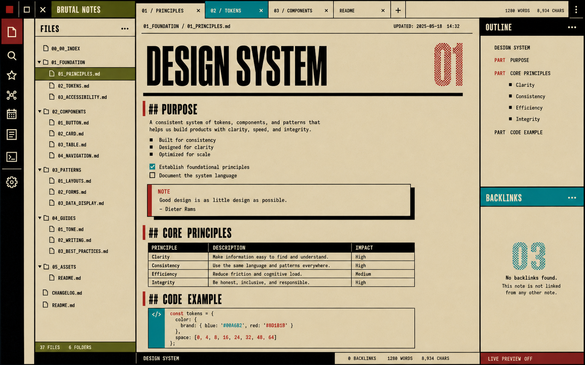

# Archive Olive

Archive Olive is a practical brutalist theme for Obsidian. It combines archival khaki, field olive, oxblood, signal cyan, carbon rules, condensed headings, and square controls with a calm long-form writing surface.



## Status

Version `0.1.0` is a locally validated first usable build. All P0 requirements in `SPEC.md` pass on Obsidian Desktop `1.12.7` for macOS.


## Design principles

- Information before decoration.
- Exposed structure instead of floating cards.
- Color communicates state and hierarchy.
- Long-form writing remains calm and readable.
- Keyboard focus and non-color state cues remain visible.
- No remote fonts, images, analytics, or companion plugin.

See [DESIGN.md](DESIGN.md) for the design system and [SPEC.md](SPEC.md) for the implementation contract.

## Local installation

1. Create a folder named `Archive Olive` inside your vault's `.obsidian/themes/` directory.
2. Copy `manifest.json` and `theme.css` into that folder.
3. Open **Settings → Appearance → Themes** and select **Archive Olive**.

The repository includes an isolated `test-vault` used for development and acceptance.

## Compatibility

- Obsidian Desktop `1.12.7` is the current validation target.
- Both light and dark modes are implemented.
- The manifest declares a provisional minimum Obsidian version of `1.8.0`; that compatibility floor must be verified before public submission.
- Mobile styling and Obsidian's mobile emulation pass locally, including `44px` primary touch targets.
- Real iOS, Android, Windows, and Linux testing remains required before `1.0.0`.

## Validation

Run the repeatable static checks:

```sh
node scripts/validate.mjs
npx -y @google/design.md lint DESIGN.md --format json
```

The isolated `test-vault` covers Markdown primitives, multilingual text, dense navigation, source mode, callouts, Graph, Canvas, and Bases. See [VALIDATION.md](VALIDATION.md) for the requirement matrix and evidence.

## Development constraints

- Prefer Obsidian CSS variables over internal selectors.
- Do not add `!important` or remote `@import` rules.
- Avoid `:has()`, especially in Canvas and Graph.
- Keep Live Preview and Reading View visually equivalent.
- Keep all assets local.

## License

A public license has not been selected yet. Do not publish the theme to the community directory until a license is added.

## Known release limitations

- The provisional `minAppVersion` has not been tested against Obsidian `1.8.0`.
- Real mobile-device and cross-platform desktop testing is pending.
- Public packaging still needs a license, repository metadata, a release tag, and final community-theme checks.
- Optional paper texture, Style Settings integration, curated plugin rules, and Obsidian Publish support remain P2 work.

## Source Manifest

- [Google DESIGN.md format](https://github.com/google-labs-code/design.md/blob/main/docs/spec.md)
- [Vercel Web Interface Guidelines](https://vercel.com/design/guidelines)
- [Obsidian developer documentation](https://docs.obsidian.md/)
- [DESIGN.md](DESIGN.md)
- [SPEC.md](SPEC.md)
- [Archive Olive reference concept](design/concepts/01f-archive-olive.png)
