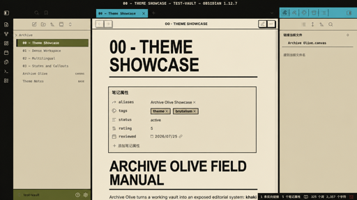
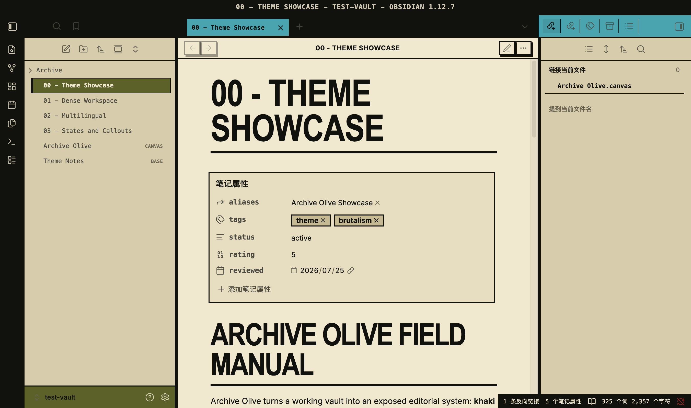
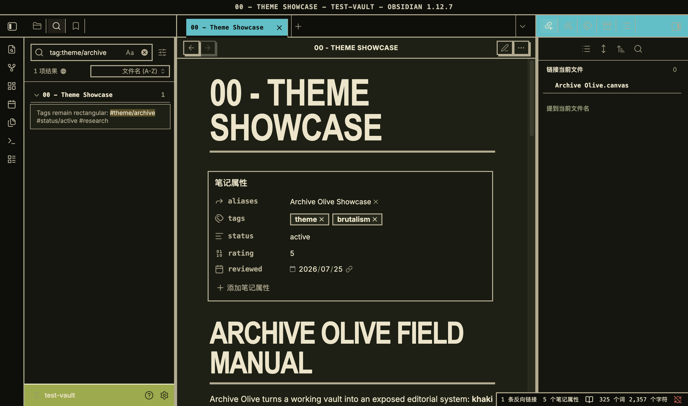

# Archive Olive

Archive Olive is a practical brutalist theme for Obsidian. It combines archival khaki, field olive, oxblood, signal cyan, carbon rules, condensed headings, and square controls with a calm long-form writing surface.



## Status

Version `0.1.8` is an opt-in pre-release beta with an Obsidian Desktop `1.12.7` compatibility floor. Its iPad and desktop settings repairs were diagnosed in the isolated test vault and require continuing owner-led device acceptance. It is not yet an official Obsidian community theme.

Archive Olive currently uses `main/theme.css` as its only BRAT channel. The `0.1.8` patch repairs settings geometry on desktop and iPad: square search and control surfaces, quiet section headings, a complete iPad drawer border, and no native drawer-bottom fade. Signal White retains its pure-white content surface, warm-white sidebar, yellow navigation chrome, and pink active-file state. Real-device file-explorer review on iPhone and iPad, large-vault virtual-scroll testing, and broader colorway review remain pending.

[Download the Archive Olive 0.1.8 Beta checkpoint](https://github.com/ivan-94/obsidian-archive-olive/releases/tag/0.1.8).





## Design principles

- Information before decoration.
- Exposed structure instead of floating cards.
- Color communicates state and hierarchy.
- Long-form writing remains calm and readable.
- Keyboard focus and non-color state cues remain visible.
- No remote fonts, images, analytics, or required companion plugin.

See [DESIGN.md](DESIGN.md) for the design system and the [theme specification](docs/specs/theme.md) for the implementation contract.

## Install with BRAT

> [!WARNING]
> This is beta software. Back up important vaults and report theme regressions with environment details.

1. Install and enable the [BRAT community plugin](https://obsidian.md/plugins?id=obsidian42-brat).
2. Open **Settings → BRAT**.
3. Choose **Add Beta Theme**. The equivalent command-palette action is **BRAT: Themes: Grab a beta theme for testing from a Github repository**.
4. Enter `https://github.com/ivan-94/obsidian-archive-olive`.
5. Open **Settings → Appearance → Themes** and select **Archive Olive**.

BRAT monitors `main/theme.css` for changes. GitHub caching can delay an update by a few minutes. If an expected update does not appear, wait and retry; as a last resort, remove the theme from BRAT and add the repository again.

## Update or remove

BRAT checks registered beta themes as part of its update process. After an update, confirm that **Archive Olive** is still selected under **Settings → Appearance**.

To stop beta updates:

1. Remove Archive Olive from the registered themes in **Settings → BRAT**.
2. Select **Default** or another theme under **Settings → Appearance → Themes**.
3. Use the folder button beside **Themes** to open the vault's theme directory, then move the `Archive Olive` folder to Trash.

Removing the BRAT registration stops monitoring but does not delete the installed theme files.

## Manual installation

1. Create a folder named `Archive Olive` inside your vault's `.obsidian/themes/` directory.
2. Copy `manifest.json` and `theme.css` into that folder.
3. Open **Settings → Appearance → Themes** and select **Archive Olive**.

Manual installations do not receive BRAT updates. The repository includes an isolated `test-vault` used for development and acceptance.

## Optional colorways

Archive Olive includes five light colorways and four dark colorways. The existing
Archive Olive and Archive Night palettes remain the defaults.
Every dark colorway keeps the Markdown editing and reading surface pure black;
its surrounding workspace chrome retains the selected palette.

| Light colorways         | Dark colorways          |
| ----------------------- | ----------------------- |
| Archive Olive (default) | Archive Night (default) |
| Blueprint News          | Carbon Teal             |
| Terracotta Ledger       | Oxblood Archive         |
| Forestry File           | Midnight Blueprint      |
| Signal White            |                         |

To select them:

1. Install and enable the
   [Style Settings community plugin](https://obsidian.md/plugins?id=obsidian-style-settings).
2. Open **Settings → Style Settings → Archive Olive**.
3. Choose **Light colorway** and **Dark colorway** independently.

The selections are stored by Style Settings for the current vault. Disabling or
removing Style Settings returns the theme to its built-in Archive Olive and
Archive Night defaults; the theme itself remains usable without the plugin.

See the [colorways specification](docs/specs/colorways.md) for the semantic
palette contract and exact primary values.

## Compatibility

- Obsidian Desktop `1.12.7` is the current validation target.
- The manifest uses `1.12.7` as the honest beta compatibility floor. It may be lowered only after runtime testing or a documented CSS-variable and selector audit.
- Both light and dark modes are implemented.
- Mobile styling and Obsidian's mobile emulation pass locally, including `44px` primary touch targets.
- A real iPad and Safari Web Inspector were used to verify drawer geometry, safe-area chrome, sidebars, and the dark Markdown surface.
- Real iPhone completion, Android, Windows, and Linux testing remain required before `1.0.0`.

## Validation

Run the repeatable static checks:

```sh
node scripts/validate.mjs
npx -y @google/design.md@0.3.0 lint DESIGN.md --format json
npx -y lightningcss-cli@1.33.0 theme.css --output-file /tmp/archive-olive-theme.css
npx -y prettier@3.9.6 --check theme.css manifest.json README.md CHANGELOG.md AGENTS.md docs/specs/README.md docs/specs/brat-beta-release.md docs/specs/colorways.md docs/specs/file-explorer-visual-hierarchy.md docs/specs/mobile-ios-visual-hardening.md docs/releases/0.1.9-beta.md docs/releases/0.1.9-beta-notes.md
```

Before publishing a beta build, run the stricter release gate:

```sh
node scripts/validate.mjs --release
```

The isolated `test-vault` covers Markdown primitives, multilingual text, dense navigation, source mode, callouts, Graph, Canvas, and Bases. See [VALIDATION.md](VALIDATION.md) for the requirement matrix and evidence.

## Cross-platform acceptance

Use the [BRAT Beta cross-platform HAT guide](hats/20260725-brat-beta-cross-platform/guide.md) for the private pilot and owner-led Windows, Linux, iOS, and Android acceptance. The guide includes preparation, evidence, privacy, update, removal, and platform-specific checklists.

The [`0.1.9` beta tag record](docs/releases/0.1.9-beta.md) documents the current tagged patch checkpoint and the remaining acceptance. Broader announcement and official-directory submission stay blocked until pilot feedback is reviewed.

## Reporting beta issues

- [Report a visual or functional bug](https://github.com/ivan-94/obsidian-archive-olive/issues/new?template=bug.yml)
- [Submit platform validation](https://github.com/ivan-94/obsidian-archive-olive/issues/new?template=platform-validation.yml)

Before reporting, disable CSS snippets and unrelated plugins where practical, and check whether the issue reproduces in a clean vault. Remove personal note content and account information from screenshots.

## Development constraints

- Prefer Obsidian CSS variables over internal selectors.
- Do not add `!important` or remote `@import` rules.
- Avoid `:has()`, especially in Canvas and Graph.
- Keep Live Preview and Reading View visually equivalent.
- Keep all assets local.

## License

Archive Olive is available under the [MIT License](LICENSE).

## Known release limitations

- Real-device iPhone/iPad review and large-vault virtual-scroll testing of the
  `0.1.6` file-explorer hierarchy are pending.
- Owner-led verification of the optional colorways on mobile and cross-platform
  desktop testing are pending.
- The GitHub pre-release is an opt-in checkpoint; pilot feedback and final community-theme checks remain required before an official-directory submission.
- BRAT and GitHub raw-content caching can delay urgent fixes or rollbacks.
- Alternate colorways still require broader desktop and mobile runtime review before a public release can claim full cross-platform visual acceptance.
- Optional paper texture, curated plugin rules, and Obsidian Publish support remain P2 work.

## Source Manifest

- [Google DESIGN.md format](https://github.com/google-labs-code/design.md/blob/main/docs/spec.md)
- [Vercel Web Interface Guidelines](https://vercel.com/design/guidelines)
- [Obsidian developer documentation](https://docs.obsidian.md/)
- [DESIGN.md](DESIGN.md)
- [Theme specification](docs/specs/theme.md)
- [Colorways specification](docs/specs/colorways.md)
- [File Explorer Visual Hierarchy specification](docs/specs/file-explorer-visual-hierarchy.md)
- [BRAT Beta release specification](docs/specs/brat-beta-release.md)
- [BRAT Beta cross-platform HAT](hats/20260725-brat-beta-cross-platform/guide.md)
- [`0.1.8` beta release record](docs/releases/0.1.8-beta.md)
- [CHANGELOG.md](CHANGELOG.md)
- [BRAT Beta release image](assets/screenshots/archive-olive-512x288.png)
- [Archive Olive reference concept](design/concepts/01f-archive-olive.png)
